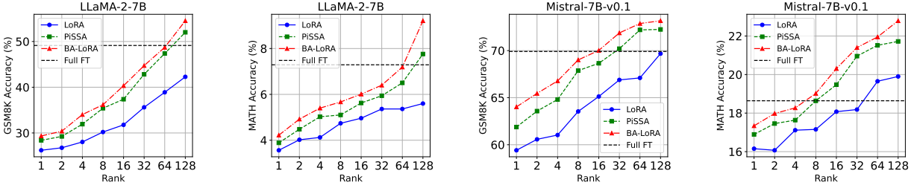
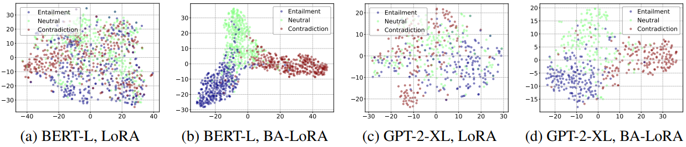
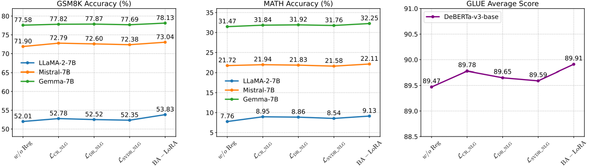

# BA-LoRA: Bias-Alleviating Low-Rank Adaptation for Mitigating Catastrophic Inheritance in Large Language Models
---
[](https://opensource.org/licenses/Apache-2.0)
[](https://arxiv.org/abs/2408.04556)
[](https://www.python.org/downloads/release/python-3100/)
[](https://pytorch.org/)
---
## 🔍Abstract

Large language models (LLMs) have demonstrated remarkable proficiency across various natural language processing (NLP) tasks. However, adapting LLMs to downstream applications requires computationally intensive and memory-demanding fine-tuning procedures. To alleviate these burdens, parameter-efficient fine-tuning (PEFT) techniques have emerged as a promising approach to tailor LLMs with minimal computational overhead. While PEFT methods offer substantial advantages, they do not fully address the pervasive issue of bias propagation from pre-training data. This work introduces Bias-Alleviating Low-Rank Adaptation (BA-LoRA), a novel PEFT method designed to counteract bias inheritance. BA-LoRA incorporates three distinct regularization terms: (1) a consistency regularizer, (2) a diversity regularizer, and (3) a singular value decomposition regularizer. These regularizers aim to enhance the models’ consistency, diversity, and generalization capabilities during fine-tuning. We conduct extensive experiments on natural language understanding (NLU) and natural language generation (NLG) tasks using prominent LLMs such as LLaMA, Mistral, and Gemma. The results demonstrate that BA-LoRA outperforms LoRA and its state-of-the-art variants. Moreover, the extended experiments demonstrate that our method effectively mitigates the adverse effects of pre-training bias, leading to more reliable and robust model outputs.

---

## 📦 Environment Setup
```bash
git clone https://github.com/llm172/BA-LoRA.git
cd BA-LoRA

conda create -n ba-lora python=3.10 -y
conda activate ba-lora

# Install core dependencies
conda install pytorch==2.4.0 torchvision==0.19.0 pytorch-cuda=12.4 -c pytorch -c nvidia
pip install -r requirements.txt

# Optional: Install Flash Attention for acceleration
pip install flash-attn --no-build-isolation
```

---

## 🚀 Quick Start

### For Natural Language Generation (NLG) Tasks:

```bash
# Start training with default parameters
sh scripts/ba-lora.sh
```

### For Natural Language Understanding (NLU) Tasks:

```bash
# Fine-tuning bert-l on SST-2 dataset
python finetune_bert_l_sst2.py
```

### Visualizing Last Hidden Layer Features with t-SNE

After fine-tuning the model for NLU tasks, you can visualize the last hidden layer features using t-SNE to analyze class separability in the feature space.

1. **Prepare Data**:
   - Save the last hidden layer features and labels as `.npy` files:
     - `features_step_final.npy`: Features.
     - `labels_step_final.npy`: Labels.

2. **Run Script**:
   - Update paths in `tsne_visualization.py`:
     ```python
     last_hidden_features_dir = '/path/to/last_hidden_features'
     output_dir = './output'
     step = 'final'
     ```
   - Run:
     ```bash
     python tsne_visualization.py
     ```

3. **Output**:
   - The t-SNE plot (`tsne_step_final.pdf`) will be saved in the specified `output_dir`.

---

## 📊 Main Results
### For NLG Tasks:
The table below summarizes the performance of BA-LoRA compared to other methods on various NLG benchmarks:

| **Models**       | **Methods** | **#Params** | **GSM8K**            | **MATH**             | **HumanEval**        | **MBPP**             | **MT-Bench**         | **Avg**  |
|-------------------|-------------|-------------|-----------------------|-----------------------|-----------------------|-----------------------|-----------------------|----------|
| LLaMA-2-7B       | Full FT     | 6738M       | 49.13±0.21            | 7.29±0.22             | 21.20±0.30            | _35.59±0.25_          | _4.91±0.01_           | 23.62    |
|                  | LoRA        | 320M        | 42.47±0.29            | 5.60±0.35             | 17.03±0.61            | 32.77±0.46            | 4.62±0.11             | 20.50    |
|                  | PiSSA       | 320M        | _52.37±0.52_          | _7.76±0.19_           | _21.55±0.44_          | 33.09±0.57            | 4.87±0.06             | _23.93_  |
|                  | **BA-LoRA** | **320M**    | **54.53±0.41**        | **9.21±17**           | **23.58±0.25**        | **36.86±0.31**        | **5.11±0.05**         | **25.86**|
| Mistral-7B       | Full FT     | 6738M       | 69.91±0.25            | 18.64±0.35            | 45.31±0.14            | 51.46±0.13            | 4.95±0.05             | 38.05    |
|                  | LoRA        | 168M        | 67.68±0.55            | 19.90±0.25            | 42.54±0.44            | 56.85±0.23            | 4.92±0.07             | 38.38    |
|                  | PiSSA       | 168M        | _72.25±0.64_          | _21.95±0.37_          | _45.37±0.25_          | _61.57±0.44_          | _5.23±0.05_           | _41.27_  |
|                  | **BA-LoRA** | **168M**    | **73.17±0.34**        | **22.79±0.56**        | **46.31±0.17**        | **62.77±0.33**        | **5.41±0.06**         | **42.09**|
| Gemma-7B         | Full FT     | 6738M       | 72.09±0.32            | 22.71±0.34            | 47.02±0.27            | 55.67±0.05            | 5.40±0.12             | 40.58    |
|                  | LoRA        | 200M        | 74.64±0.58            | 31.16±0.33            | 51.64±0.28            | 63.52±0.65            | 5.01±0.03             | 45.19    |
|                  | PiSSA       | 200M        | _77.58±0.41_          | _31.47±44_            | _53.22±35_            | _65.49±0.18_          | _5.66±0.05_           | _46.68_  |
|                  | **BA-LoRA** | **200M**    | **78.13±0.25**        | **32.25±25**          | **54.44±0.15**        | **66.25±0.33**        | **5.73±0.07**         | **47.36**|

### For NLU Tasks:
The table below compares BA-LoRA's performance with other methods on NLU benchmarks:

| **Methods** | **#Params** | **MNLI**         | **SST-2**           | **MRPC**          | **CoLA**          | **QNLI**          | **QQP**           | **RTE**           | **SST-B**         | **Avg**  |
|-------------|-------------|------------------|---------------------|-------------------|-------------------|-------------------|-------------------|-------------------|-------------------|----------|
| Full FT     | 184M        | 90.34±0.18       | **96.33±0.11**      | 89.95±1.07        | 71.43±0.72        | 94.24±0.10        | 92.11±0.28        | 83.75±1.81        | 91.04±0.48        | 88.86    |
| BitFit      | 0.1M        | 89.54±0.29       | 94.68±0.11          | 87.95±1.33        | 67.31±0.49        | 92.45±0.17        | 88.72±0.45        | 79.12±0.39        | 91.63±0.37        | 86.43    |
| HAdapter    | 1.22M       | 90.23±0.07       | 95.38±0.06          | 89.97±0.27        | 68.73±0.27        | 94.31±0.29        | 91.99±0.28        | 84.76±0.39        | 91.58±0.13        | 88.37    |
| PAdapter    | 1.18M       | 90.42±0.36       | 95.49±0.10          | 89.71±0.35        | 69.04±0.10        | 94.38±0.26        | 92.15±0.43        | 85.53±0.18        | 91.69±0.13        | 88.55    |
| LoRA        | 1.33M       | 90.71±0.16       | 94.79±0.16          | 89.85±0.21        | 70.05±0.34        | 93.94±0.09        | 92.07±0.48        | 85.43±0.09        | 91.67±0.29        | 88.56    |
| LoHA        | 1.33M       | 90.74±0.32       | 94.92±0.47          | 90.43±0.48        | 70.63±0.10        | 93.95±0.28        | 92.05±0.09        | 86.41±0.10        | 91.72±0.28        | 88.86    |
| DoRA        | 1.27M       | 90.48±0.10       | 95.85±0.08          | 91.04±0.15        | 71.03±0.18        | 94.21±0.37        | 92.34±0.16        | 86.19±0.25        | 91.92±0.38        | 89.13    |
| AdaLoRA     | 1.27M       | _90.87±0.08_     | 96.18±0.43          | 90.81±0.40        | _71.64±0.12_      | _94.68±0.46_      | _92.37±0.35_      | _87.78±0.36_      | 91.97±0.43        | _89.53_  |
| PiSSA       | 1.33M       | 90.47±0.44       | 95.81±0.45          | _91.48±0.49_      | _72.27±0.29_      | 94.41±0.41        | 92.21±0.26        | 87.14±0.08        | _91.93±0.25_      | _89.47_  |
| BA-LoRA     | 1.33M       | **90.92±0.38**   | _96.25±0.09_        | **91.83±0.25**    | **72.79±0.42**    | **94.84±0.26**    | **92.59±0.18**    | **87.87±0.31**    | **92.15±0.08**    | **89.91**|

---

### Various Ranks
Performance Comparison of Full Fine-Tuning, LoRA, PiSSA, and BA-LoRA Across Different Ranks:



---

### t-SNE Visualization
t-SNE Visualizations Comparing Last Hidden Layer Features of BERT-L and GPT-2-XL Fine-Tuned with LoRA and BA-LoRA on the MNLI task of GLUE:



---

### Ablation Study
Ablation Study of BA-LoRA Regularizations on GSM8K, MATH, and NLU Tasks. Here, $\mathrm{Reg}$ denotes “Regularization,” and $\mathit{w/o}\ \mathrm{Reg}$ indicates “without regularization.” $L_{CR}$ , $L_{DR}$ , and $L_{SVDR}$ represent the application of only the corresponding regularization, while “BA-LoRA” refers to the baseline using all regularizations.



---

## 📄 Citation

If you find this project useful in your research or work, please consider citing it:

```bibtex
@misc{chang2025balorabiasalleviatinglowrankadaptation,
      title={BA-LoRA: Bias-Alleviating Low-Rank Adaptation to Mitigate Catastrophic Inheritance in Large Language Models}, 
      author={Yupeng Chang and Yi Chang and Yuan Wu},
      year={2025},
      eprint={2408.04556},
      archivePrefix={arXiv},
      primaryClass={cs.CL},
      url={https://arxiv.org/abs/2408.04556}, 
}

```
---

## 📜 License
This project is licensed under the Apache License 2.0 - see the [LICENSE](LICENSE) file for details.

---
